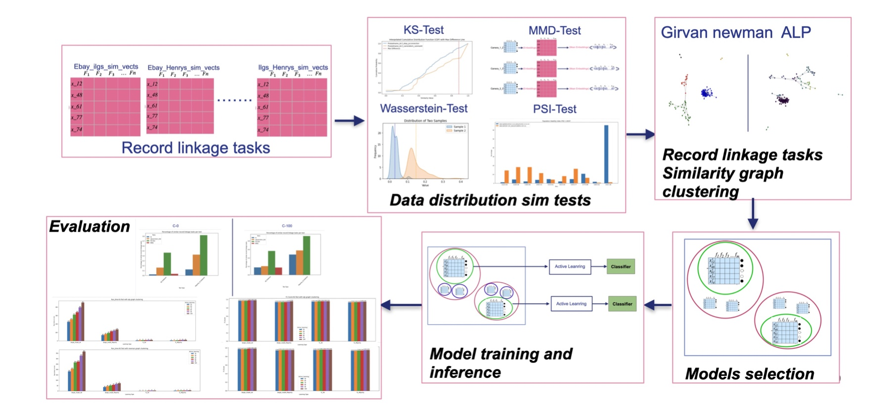

# Project Overview

This README provides an overview of the methods used and the data collection process in this project.

The objective of this project is to apply Transfear Learning in the context of multi source Entity resolution. 

This is the project Pipline


Our project pipeline is designed to effectively transfer learning to target linkage tasks while ensuring that these target tasks maintain the same distribution as those used to train the models.

The pipeline begins with preprocessing the multiple data sources provided as input. Next, we generate feature vector datasets (linkage tasks) for each pair of datasets and apply a range of statistical and machine learning methods to identify similarities in their distributions.

Once the similarities are identified, we construct a similarity graph and use community detection algorithms to cluster the datasets. From each of these clusters, we select several models, train them, and use their capabilities to infer and predict feature vector datasets that have similar distributions.


## Methods

- **Statistical Methods**  
  Applied to compare the distributions between different record linkage tasks.

- **Graph Clustering**  
  Utilized to cluster the linkage tasks into strongly connected components.

- **Active Learning**  
  Employed to label selected tasks efficiently.

- **Machine Learning**  
  Algorithms are trained on linkage tasks labeled using active learning techniques.

- **Evaluation Metrics**  
  Used to assess the performance of the proposed framework.

## Data Collection

- **Camera Datasets**  
  Data collected from approximately 23 different sources.

### Repository structure

``` plain
├── 📁 data                   
│   ├── 📁 raw_data             <-- Unprocessed camera datasets
│   ├── 📁 cleaned_data         <-- Preprocessed camera datasets
│   ├── 📁 help_data            <-- Auxiliary data used during preprocessing
│   ├── 📁 linkage_tasks        <-- Linkage tasks for each pair of sources, with the first two columns containing record IDs
│   ├── 📁 linkage_tasks_labeled<-- Labeled linkage tasks generated using active learning
│   └── 📁 ground_truth_data    <-- Ground truth data for the linkage tasks

├── 📁 results                  
│   ├── 📁 statistical_tests    <-- Contains images of statistical test results
│   ├── 📁 clustering           <-- Contains figures of the generated clusters
│   └── 📁 linkage_results      <-- Precision, Recall, and F1-scores for the linkage tasks

├── 📁 meta_tl                  <-- Project codebase
│   ├── 📁 data_pre_processing      <-- Data preprocessing scripts
│   │   ├── 📃 data_cleaning.py     <-- Various methods used to clean raw data sources
│   │   ├── 📃 generate_ground_truth_data.py  <-- Generates ground truth labels for the record pairs
│   │   └── 📁 record_linkage           <-- Implementation of the record linkage process
│   │       ├── 📃 blocking.py          <-- Methods for blocking
│   │       ├── 📃 comparison.py        <-- Methods for comparing records sharing the same blocking keys
│   │       ├── 📃 load_data_set.py     <-- Prepares datasets for the record linkage process
│   │       └── 📃 record_linkage_main.py <-- Main script for record linkage
│   ├── 📃 statistical_tests.py     <-- Implementations of statistical methods for comparing linkage task distributions
│   ├── 📃 graph_clustering.py      <-- Methods for graph clustering of linkage tasks
│   ├── 📃 model_selection.py       <-- Methods for selecting linkage tasks from clusters
│   ├── 📃 active_learning.py       <-- Active learning methods for labeling selected tasks
│   ├── 📃 transfear_learning.py    <-- Apply the trained selected linkage tasks on the other linkage tasks
│   ├── 📃 evaluation.py            <-- Implementation of evaluation methods for assessing the proposed methods
│   ├── 📃 utils.py                 <-- Helper functions used throughout the project

├── 📃 main.py                     <-- Main script for the project
├── 📃 requirements.txt            <-- Libraries and dependencies
└── 📃 README.md                   <-- Project documentation

```


